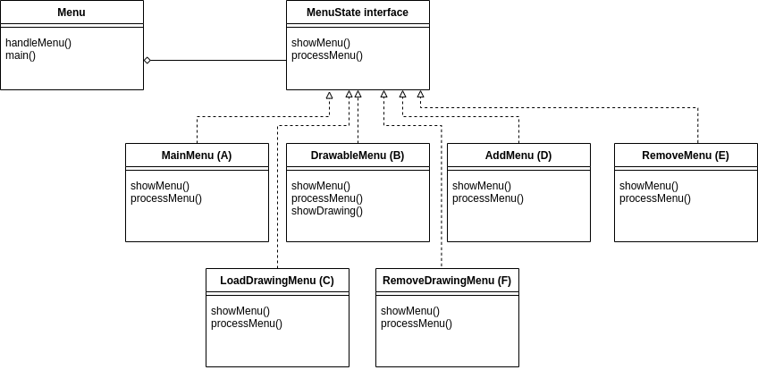

# Lehrprojekt _**Graphic**_ zur Einführung in OOP

## Referenzen

### Standardwerke für die Javaentwicklung
- [Java ist auch eine Insel](https://amzn.to/3bBG7vt) ([Web-Version](http://openbook.rheinwerk-verlag.de/javainsel/))
- [Effective Java](https://amzn.to/2XyfEH4) ([Deutsche Ausgabe](https://amzn.to/38Dr6HK))
- [Clean Code](https://amzn.to/2P85FVA) ([Deutsche Ausgabe](https://amzn.to/2Xzdnvp))
- [Design Pattern](https://amzn.to/2LjTqGv) der Gang of four ([Deutsche Ausgabe](https://amzn.to/2XB0UqT))

### Dokumentation
- [Git Anwendungshandbuch](https://git-scm.com/book/de/v2)
- [JUnit 5 User Guide](https://junit.org/junit5/docs/current/user-guide/)
- [Studienprojekt Design Pattern](https://www.philipphauer.de/study/se/design-pattern.php)

### Git Workflow
`git init` (Git initialisieren)

`git add .` (ganzes Verzeichnis adden)

`git remote add origin git@github.com:user/repository.git` (Git remote adden)

`git status` (Status abfragen)

`git commit -am "Message"` (committen und commit-Message absetzen)

`git push origin master` (nach master pushen)

`git tag -a tagname -m "Message"` (commit taggen)

`git clone git@gihub.com:user/repository.git` (Repository clonen)

`git pull origin master` (Repository pullen)

## Tag 0

#### Wiederholung:
```
Klassen, Vererbung, Konstruktoren, Member, Getter/Setter, Membermethoden
Collection, List, Map
JUnit
Maven
```
#### Aufgabenstellung:
```
1. Was sind Design Pattern?
2. Wozu benötige ich Design Pattern?
3. Klassifikation von Design Patterns
4. Auseinandersetzung mit MVC (im Kontext der Desktopentwicklung)
5. Auseinandersetzung mit Observer- und State-Pattern
```
#### Materialien:

- [Design Pattern (GoF](https://de.wikipedia.org/wiki/Entwurfsmuster_(Buch))
- [Studienprojekt Design Pattern](https://www.philipphauer.de/study/se/design-pattern.php)

#### Ergebnisse:

- mit den Themen der Aufgabenstellung auseinandergesetzt
- ein Projekt Graphic erstellt und nach Github gepusht    

## Tag 1

#### Aufgabenstellung:

1. Entwurf einer Klassenstruktur für primitive Grafikelemente (Punkt, Linie, Ellipse und Rechteck)
2. Entsprechende Member und Zugriffsmethoden entwickeln
3. Entwurf einer Klasse, die Instanzen dieser Primitiven zu einer Zeichnung zusammenfasst, inklusive Member und Methoden
4. Schreiben von Tests, um sicherzustellen, dass die Methoden der entworfenen Klassen wie vorgesehen arbeiten

#### Materialien:

- keine

#### Ergebnisse:

- Klassen im Projekt angelegt
  - `public class Vector{}`
  - `public class Line{}`
  - `public class Oval{}`
  - `public class Rectangular{}`
  - `public class Drawing{}`
  
- Vector: zwei Membervariablen angelegt
  - `private int x`
  - `private int y`
  
- Line: zwei Membervariablen angelegt
  - `private Vector start`
  - `private Vector end`
  
- Oval: drei Membervariablen angelegt
  - `private Vector center`
  - `private int height`
  - `private int width`
  
- Rectangle: drei Membervariablen angelegt
  - `private Vector start`
  - `private int height`
  - `private int width`

- mittels `Alt+Einf` Konstruktoren, Getter und Setter in den Klassen erstellt
  - am Beispiel Vector.java:
    - Leeren Konstruktor: `public Vector() {}`
    - Konstruktor: `public Vector( int x , int y ) { setX(x) ; setY(y) ; }`
    - Getter für x: `public int getX() { return x ; }`
    - Setter für x: `public void setX(int x) { this.x = x ; }`
    - Setter und Getter für y
    
- Interface aegelegt
  - `public interface Primitive{}`
  
- Primitive an alle fünf Klassen vererben
  - am Beispiel Vector.java: 
    - `public class Vector implements Primitive{}`
  
- Drawing: ArrayList 'primitives' und sechs Methoden erstellt
  - `List<Primitive> primitives = new ArrayList();`
  - `add(Primitive primitive)`
  - `getSize()`
  - `remove(Primitive primitive)`
  - `remove(int index)`
  - `getPrimitive(int index)`
  - `undo()`

- Tests für die jeweiligen Klassen mittel `Strg+Shift+T` erstellt
  - am Beispiel VectorTest.java:
    - `class VectorTest {}` 
    - mit `void constructorTest() {}` Konstruktor testen
    - mit `void defaultConstructorTest() {}` leeren Konstruktoren testen
    - mit `void setterTest() {}` Setter testen

- Test für Drawing-Klasse mittels `Strg+Shift+T` erstellt
  - `void addTest() {}` - Funktioniert das Hinzufüge von Elementen ordnungsgemäß?
  - `void testRemoveDrawing() {}` - Funktioniert das Entfernen von Elementen ordnungsgemäß?
  - `void testGetDrawing() {}` - Funktioniert Aufruf anhand vom Index?
  - `void testUndo() {}` - Funktioniert das Entfernen des letzten Elements?
  
## Tag 2
#### Wiederholung:

- Besprechung und Diskussion der Aufgabenstellung und Ergebnisse des Vortages

#### Aufgabenstellung:

- Versionsverwaltung Git verwenden, um Projekte zu klonen
- Design Pattern 'Observer Pattern' im Projekt implementieren

#### Materialien:

- [Git Anwendungshandbuch](https://git-scm.com/book/de/v2)
- [JUnit 5 User Guide](https://junit.org/junit5/docs/current/user-guide/)
- [Design Pattern](https://amzn.to/2LjTqGv) der Gang of four ([Deutsche Ausgabe](https://amzn.to/2XB0UqT))

#### Ergebnisse:

- Interfaces GraphicObserver und GraphicObservable angelegt
  - `public interface GraphicObserver{}`
  - `public interface GraphicObservable{}`
  
- Drawing: ArrayList und drei @Override-Methoden angelegt:
  - `List<GraphicObserver> graphicObservers = new ArrayList();`
  - `public void addObserver(GraphicObserver graphicObserver) { observers.add(graphicObserver); }`
  - `public void removeObserver(GraphicObserver graphicObserver) { observers.remove(graphicObserver); }`
  - `public void notifyObserver() { for (int i = 0 ; i < observers.size(); i++) { observers.get(i).update(); } }`
  
- GraphicObserver: update()-Methode aufrufen
  - `void update()`
  
- GraphicObservable: drei Methoden aufrufen
  - `addObserver(GraphicObserver graphicObserver)`
  - `removeObserver(GraphicObserver graphicObserver)`
  - `notifyObserver()`

- Test angelegt
  - `void testObservable() {}` - Funktioniert update() in GraphicObservable ordnungsgemäß?

## Tag 3
#### Wiederholung:

- Besprechung und Diskussion der Aufgabenstellung und Ergebnisse des Vortages 

#### Aufgabenstellung:

- Namensgebungen überdenken
- Tests überarbeiten

#### Materialien

- [Studienprojekt Design Pattern](https://www.philipphauer.de/study/se/design-pattern.php)

#### Ergebnisse

- testObservable erweitert: Werden add und remove korrekt gezählt und an Observer übermittelt? 
- alle Tests sind grün
- Namensgebung überarbeitet (englische Variablen-, Methoden- und Klassennamen)
- diese README.md zur Dokumentation angelegt

## Tag 4
####  Wiederholung

- Besprechung und Diskussion der Ergebnisse der Vorwoche

#### Aufgabenstellung:

- Entwurf einer Menüführung für das Projekt Graphic
- Implementierung der Menüfühung

#### Materialien

- [State Pattern](https://www.philipphauer.de/study/se/design-pattern/state.php)

#### Ergebnisse

- Entwurf für die Menüführung


- Interface MenuState angelegt
- Klassen Menu, MainMenu und DrawableMenu angelegt

## Tag 5

####  Wiederholung

- Besprechung und Diskussion der Ergebnisse des Vortages

#### Aufgabenstellung:

- Entwurf eines Menüsystems mithilfe von UML
- Implementierung des Menüs anhand des UML-Diagramms
- Funktionalität der Menüpunkte herstellen
- Überschreibung der toString-Methode der Primitive
- in Java-Insel lesen: Kapitel 17.1, 17.2, 17.4.4, 17.4.5 und **17.10**

#### Materialien

- [Java-Insel Kapitel 17](http://openbook.rheinwerk-verlag.de/javainsel9/javainsel_17_010.htm)

#### Ergebnisse

- mithilfe eines UML-Diagramms ein Menüsystem entworfen



- Implementierung des Menüs
- Funktionalität der Menüpunkte hergestellt
- Überschreibung der toString-Methode der Primitive
- in Java-Insel Kapitel 17.1, 17.2, 17.4.4 und 17.4.5 gelesen

## Tag 6

#### Aufgabenstellung

- in Java-Insel lesen: Kapitel 17.10
- Beispiele zum Abspeichern und Laden anschauen

#### Materialien

- [Java-Insel Kapitel 17](http://openbook.rheinwerk-verlag.de/javainsel9/javainsel_17_010.htm)

#### Ergebnisse

- in Java-Insel Kapitel 17.10 gelesen
- einige Beispiele ausprobiert: FileOutputStream und FileInputStream
- Save-Funktion im Projekt implementiert

## Tag 7

#### Aufgabenstellung

- in Java-Insel lesen
- Save-Funktion im Projekt implementieren

#### Materialien

- [Java-Insel Kapitel 17](http://openbook.rheinwerk-verlag.de/javainsel9/javainsel_17_010.htm)

#### Ergebnisse

- Interface MenuOperation angelegt
- Load-Funktion im Projekt implementiert
- Remove-Funktion nach Index implementiert
- in Java-Insel zu OOP gelesen